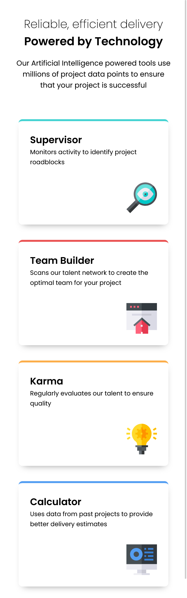
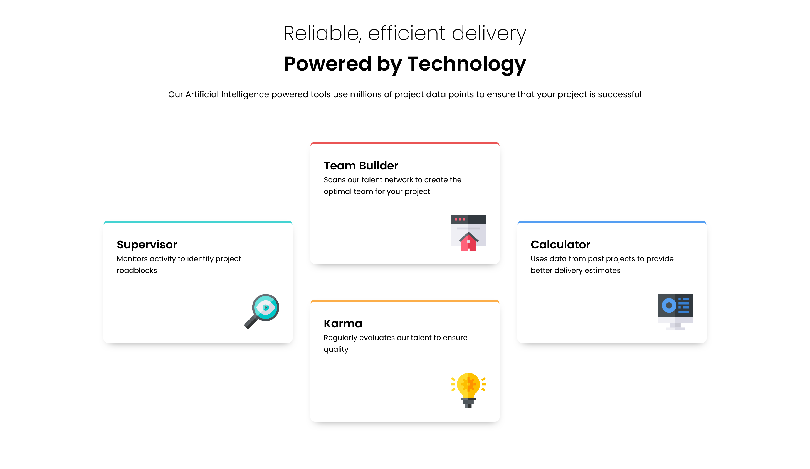

# Frontend Mentor - Four card feature section solution

This is a solution to the [Four card feature section challenge on Frontend Mentor](https://www.frontendmentor.io/challenges/four-card-feature-section-weK1eFYK). Frontend Mentor challenges help me improve my coding skills by building realistic projects.

## Table of contents

- [Overview](#overview)
  - [The challenge](#the-challenge)
  - [Screenshot](#screenshot)
  - [Links](#links)
- [My process](#my-process)
  - [Built with](#built-with)
  - [What I learned](#what-i-learned)
  - [Useful resources](#useful-resources)
- [Author](#author)

## Overview

### The challenge

Users should be able to:

- View the optimal layout for the site depending on their device's screen size

### Screenshot

  <figure>
      <figcaption>Mobile Screen Size</figcaption>
      
  </figure>

  <figure>
      <figcaption>Medium Screen Size</figcaption>
      
  </figure>

  <figure>
      <figcaption>Desktop Screen Size</figcaption>
      
  </figure>

### Links

- Solution URL: [link](https://www.frontendmentor.io/solutions/reponsive-4-card-section-page-using-css-grid-vHjA7NJZMZ)
- Live Site URL: [link](https://pete13232.github.io/four-card-section-challenge/)

## My process

### Built with

- Semantic HTML5 markup
- CSS custom properties
- Flexbox
- CSS Grid
- Mobile-first workflow

### What I learned

I learned a basic of css grid to manipulate with layout for each screen size.

### Useful resources

- [CSS Grid - Full Beginner Course](https://www.youtube.com/watch?v=BIx3XdHA8-Y) - This helped me to grasp a basic concept of CSS Grid a lot!

## Author

- Frontend Mentor - [@pete13232](https://www.frontendmentor.io/profile/pete13232)
